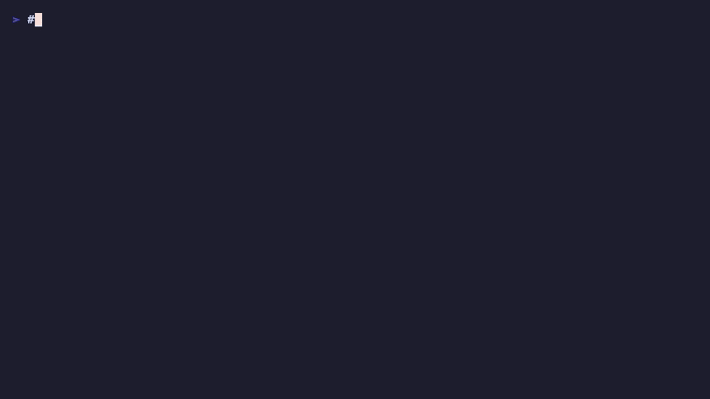
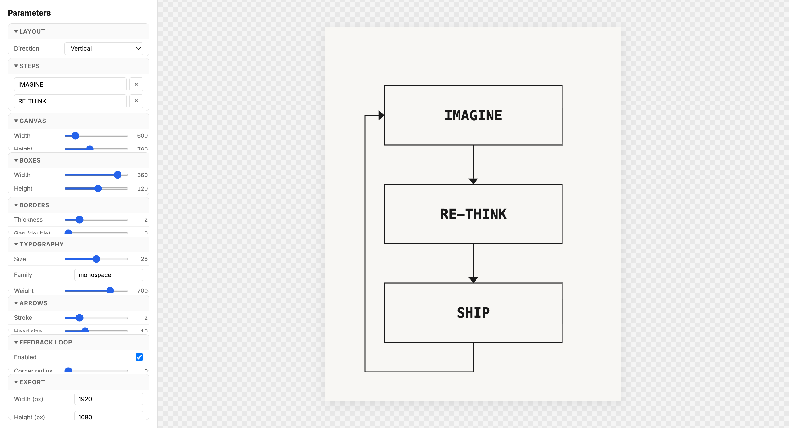

<div align="center">

# Diagram Creator




**A configurable flow diagram builder with real-time preview, shareable links, and multi-format export.**

[](https://www.typescriptlang.org/)
[](https://react.dev/)
[](https://chakra-ui.com/)
[](#)
[](https://bun.sh/)

</div>

<br/>

<p align="center">
  
</p>

---

## Features

| | Feature | Description |
|---|---|---|
| **Layout** | Vertical & horizontal | Switch direction with one click, auto-adjusts canvas |
| **Templates** | 6 diagram presets | Simple Process, Design Thinking, Sprint Cycle, Build-Measure-Learn, Deploy Pipeline, PDCA Cycle |
| **Typography** | Google Fonts picker | Rubik, Inter, Space Grotesk, JetBrains Mono, Playfair Display, DM Sans + custom input |
| **Background** | 4 modes | Solid, gradient, pattern (dots/lines/cross-hatch), transparent |
| **Export** | SVG, AVIF, TIFF | Aspect-ratio-locked raster export with 1x/2x/4x scale multipliers |
| **Share** | URL encoding | Full diagram config compressed into a shareable URL hash |
| **Responsive** | Mobile drawer | Sidebar collapses to a slide-out drawer on small viewports |
| **PWA** | Installable | Works offline with service worker caching |
| **A11y** | Accessible SVG | `role="img"`, `aria-label`, keyboard-navigable controls |

---

## Quick Start

```bash
# Clone and install
git clone https://github.com/your-username/diagram-creator.git
cd diagram-creator
bun install

# Start development server
bun run dev
```

Open [http://localhost:5173](http://localhost:5173) in your browser.

---

## Scripts

| Command | Description |
|---------|-------------|
| `bun run dev` | Start Vite dev server with HMR |
| `bun run build` | Type-check + production build |
| `bun run preview` | Preview production build locally |

---

## Tech Stack

| Layer | Technology |
|-------|-----------|
| Framework | React 19 + TypeScript 5.9 |
| UI | Chakra UI v3 + Ark UI |
| State | Zustand |
| Build | Vite 8 + Bun |
| PWA | vite-plugin-pwa + Workbox |
| Export | Canvas API (AVIF), custom TIFF encoder (zero deps) |

---

## Architecture

```
src/
├── main.tsx                        # React root + ChakraProvider
├── App.tsx                         # URL hash hydration + AppShell
├── store.ts                        # Zustand store (64 LOC)
├── types.ts                        # DiagramConfig + BackgroundConfig + presets
├── theme.ts                        # Chakra system config
├── components/
│   ├── shell/
│   │   ├── AppShell.tsx            # Flex root: TopBar + Sidebar + Preview
│   │   ├── Sidebar.tsx             # Desktop sidebar (320px)
│   │   ├── MobileDrawer.tsx        # Mobile slide-out drawer
│   │   ├── TopBar.tsx              # Hamburger + title (mobile)
│   │   └── PreviewArea.tsx         # Checkerboard bg + centered SVG
│   ├── svg/
│   │   ├── DiagramSVG.tsx          # forwardRef SVG root + layout
│   │   ├── SvgBox.tsx              # Box rect + optional double border
│   │   ├── SvgArrow.tsx            # Directional arrow + arrowhead
│   │   ├── SvgBackground.tsx       # Solid | gradient | pattern | transparent
│   │   └── SvgFeedbackLoop.tsx     # Curved feedback path
│   ├── panels/
│   │   ├── ControlPanel.tsx        # Accordion with 9 sections + Export
│   │   ├── LayoutPanel.tsx         # Direction + preset selector
│   │   ├── StepsPanel.tsx          # Add/remove/rename steps
│   │   ├── CanvasPanel.tsx         # Width + height sliders
│   │   ├── BackgroundPanel.tsx     # 4-mode background config
│   │   ├── BoxesPanel.tsx          # Box dimensions + corner radius
│   │   ├── BordersPanel.tsx        # Thickness + gap + color
│   │   ├── TypographyPanel.tsx     # Font picker + size + weight + color
│   │   ├── ArrowsPanel.tsx         # Stroke + head size + color
│   │   ├── FeedbackPanel.tsx       # Toggle + radius + label
│   │   ├── ExportPanel.tsx         # SVG/AVIF/TIFF + share + aspect lock
│   │   └── shared/
│   │       ├── SliderField.tsx     # Label + Slider + readout
│   │       ├── ColorField.tsx      # Label + <input type="color">
│   │       └── SelectField.tsx     # Label + NativeSelect
│   └── templates/
│       ├── TemplateGallery.tsx     # Dialog + 3-column grid
│       └── TemplateCard.tsx        # Mini preview + name + description
├── data/
│   └── templates.ts                # 6 diagram template configs
├── hooks/
│   ├── use-export.ts               # SVG/AVIF/TIFF export hook
│   └── use-share-link.ts           # URL hash encode/decode
└── lib/
    ├── geometry.ts                 # computeVerticalLayout / computeHorizontalLayout
    ├── feedback-paths.ts           # Pure path-data functions
    ├── export-svg.ts               # XMLSerializer → blob → download
    ├── export-raster.ts            # Canvas AVIF + custom TIFF encoder
    └── url-codec.ts                # Config ↔ base64 URL hash
```

---

## Export Formats

| Format | Type | Notes |
|--------|------|-------|
| **SVG** | Vector | Clean markup, opens in Figma/Illustrator/Inkscape |
| **AVIF** | Raster | Modern lossy format, excellent compression |
| **TIFF** | Raster | Uncompressed RGBA, zero-dependency encoder |

All raster exports respect canvas aspect ratio with optional 1x/2x/4x scaling.

---

## Templates

| Template | Steps | Font | Layout |
|----------|-------|------|--------|
| Simple Process | INPUT → PROCESS → OUTPUT | Rubik | Vertical |
| Design Thinking | EMPATHIZE → DEFINE → IDEATE → PROTOTYPE → TEST | DM Sans | Horizontal |
| Sprint Cycle | PLAN → BUILD → REVIEW → RETRO | Space Grotesk | Vertical |
| Build-Measure-Learn | BUILD → MEASURE → LEARN | Inter | Vertical |
| Deploy Pipeline | COMMIT → BUILD → TEST → DEPLOY | JetBrains Mono | Horizontal |
| PDCA Cycle | PLAN → DO → CHECK → ACT | Rubik | Vertical |

---

## Deploy

### Vercel

```bash
bun run build
npx vercel --prod
```

### Any static host

The `dist/` folder after `bun run build` is a static site. Deploy to Netlify, Cloudflare Pages, GitHub Pages, or any static host.

---

## License

MIT
